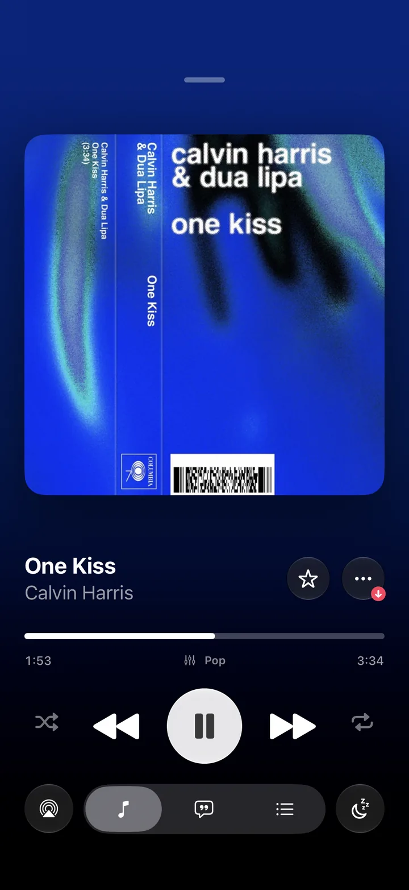
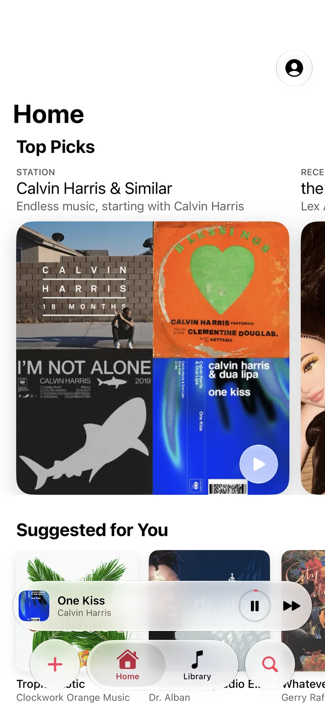
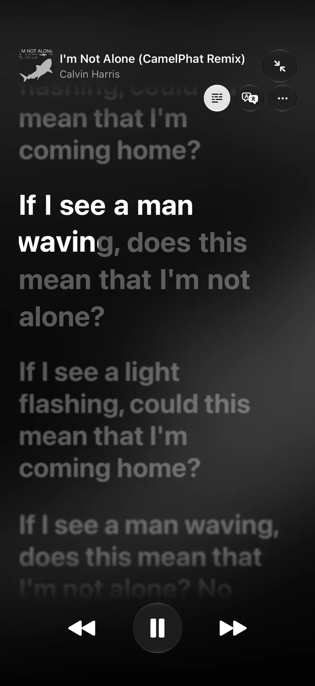
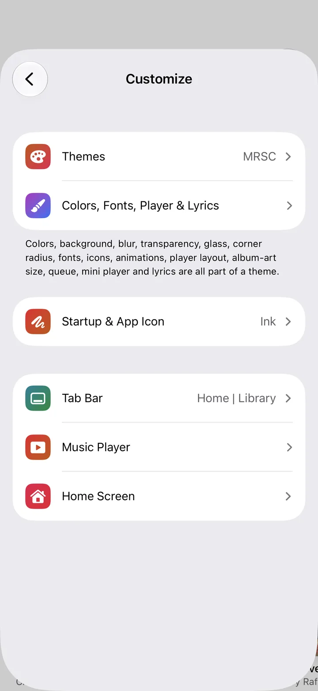

# MRSC

The music player with way too many settings.

MRSC is a free, offline music player for iPhone, built for iOS 26 with Liquid Glass. It plays the music you own: files on your iPhone, a folder that stays in sync, or your own Jellyfin, Navidrome or Subsonic server. No ads, no subscription, no account.

[Website](https://mrsc.pages.dev) · [Discord](https://discord.gg/kZTTJxjvQW) · [Buy a coffee](https://ko-fi.com/henrikkk)

<p align="center">
  
  
  
  
</p>

## What's in it

- Seven built-in themes and a full theme editor: colors, fonts, textures, cover shape, player layout, button row, tab bar, Home screen, app icon
- Synced, word-by-word lyrics, recognized on the device when a song has none, with on-device translation
- 10-band EQ per headphone, song or album, loudness normalization, crossfade, gapless playback, beat-matched transitions
- Smart search in plain English or German, daily mixes made on the device
- CarPlay, widgets, Live Activity, Siri and Shortcuts

## Building

You need Xcode 26 and [XcodeGen](https://github.com/yonaskolb/XcodeGen). The Xcode project is generated from `project.yml`.

```bash
brew install xcodegen
xcodegen generate
open MRSC.xcodeproj
```

To run it on your own iPhone, change `DEVELOPMENT_TEAM` and the bundle identifiers in `project.yml` to your own, then generate again.

## Layout

- `MRSC/`: the app (SwiftUI)
- `MRSCWidgets/`: widgets and the Live Activity
- `Shared/`: code used by both
- `website/`: the static site at mrsc.pages.dev (see `website/README.md`)
- `Branding/wordmark/`: the brushed MRSC letters, turned into `MRSC/WordmarkData.swift`
- `docs/`: notes on the app's structure and TestFlight

## Server extensions

MRSC can load extensions: small JavaScript files that connect it to a music server or API. MRSC doesn't include any, and this repo doesn't either. Please don't open pull requests that add extensions for services you don't have the rights to.

## Contributing

Bug reports and ideas are welcome as issues. Pull requests too, especially if you think there aren't enough settings yet. For quick questions and sharing themes, the Discord is the better place.

## License

The code is licensed under the [GNU General Public License v3.0](LICENSE). If you ship a modified version, its source has to be open too.

The name MRSC and the MRSC logo are not part of that license. If you publish your own build, please give it a different name and icon.
