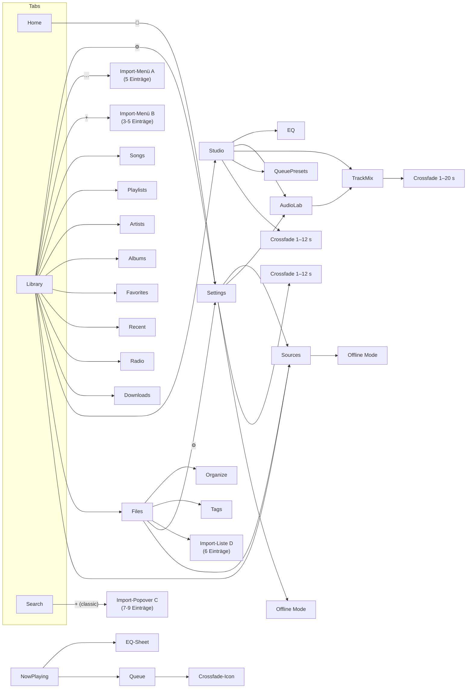
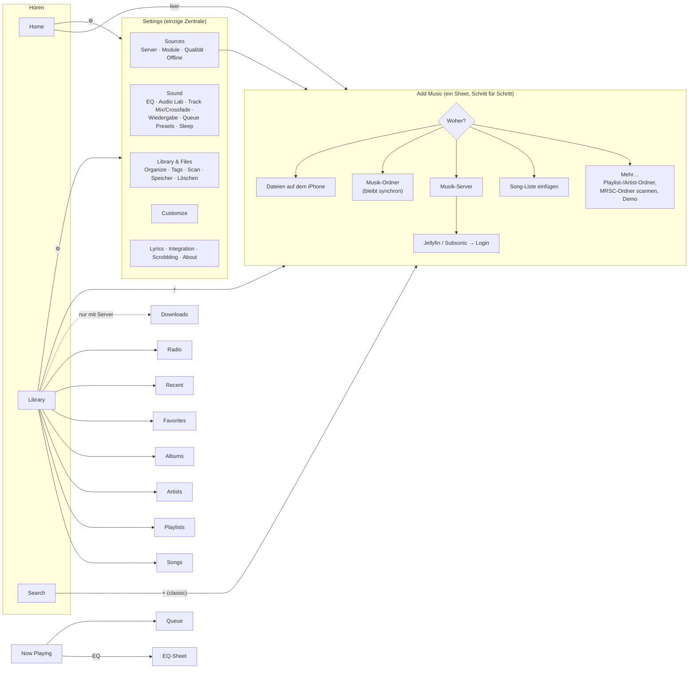
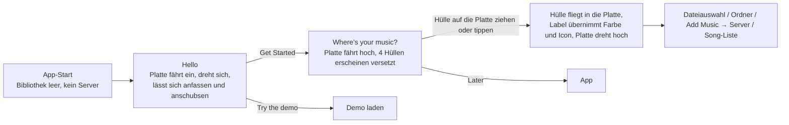

# MRSC – Flow-Graph

Ziel: **Jede Sache hat genau einen Ort.** Man sieht zuerst nur das Nötige, der Rest öffnet sich erst, wenn man hinein tippt (Progressive Disclosure).

Drei Ebenen:

1. **Hören:** Home, Library, Search. Hier steht nur Musik, keine Werkzeuge.
2. **Jetzt läuft:** Now Playing. Alles zum aktuellen Song.
3. **Einrichten:** Settings ist die einzige Zentrale. Alles, was die App konfiguriert, liegt dort.

---

## Ist-Zustand (vereinfacht)

Probleme:

- **Import:** 4 verschiedene Import-Menüs, die jeweils andere Optionen anbieten.
- **Doppelte Wege:** Sources ist 3× erreichbar, Audio Lab 4×, Crossfade 4× (mit drei verschiedenen Bereichen).
- **Settings-Zugang:** 3 verschiedene Icons öffnen Settings.
- **Library:** In der Library stehen Werkzeuge (Studio, Files, Sources) zwischen der Musik.
- **Leere Bibliothek:** Alle 11 Zeilen erscheinen mit „0“. Songs und Albums verweisen auf einen „Files tab“, der gar nicht existiert.

---

## Soll-Zustand

Regeln:

- **Crossfade** gibt es nur noch in Track Mix. Queue und Now Playing zeigen lediglich den Status.
- **Offline Mode** steht nur in Sources und erscheint erst, wenn eine Streaming-Quelle existiert.
- **„Delete All Music“** gibt es nur unter Library & Files.
- **Leere Bibliothek:** Es erscheint nur die Karte „Add Music“, ohne leere Zeilen.
- **Menüs:** höchstens 6 direkte Einträge, alles Weitere kommt in ein Untermenü.

---

## Phasen

| Phase | Inhalt | Status |
|---|---|---|
| 1 | Settings als einzige Zentrale · ein Add-Music-Flow · Library nur mit Musik · doppelte Einstellungen entfernen · Router-Bugs (Suche bleibt offen, Back-Stack geht verloren) | ✅ fertig, im Simulator getestet |
| 2 | Now Playing & Menüs auf ≤ 6 Einträge · Crossfade/Queue-Status · EQ-Knopf → Sound für diesen Song | offen |
| 3 | Feedback & Sicherheit: Namensabfrage bei „Save Queue as Playlist“, nach dem Song-List-Import zur Playlist springen, Bestätigung vor dem Löschen, Organize-Sackgasse, Cover Designer standardmäßig auf „This Song“ | offen |
| 4 | Erster Start: kurzer Einstieg „Woher kommt deine Musik?“ | ✅ fertig (`Onboarding.swift`), im Simulator getestet |

### Onboarding (Phase 4)

- **Bewegung:** Springs statt starrer Kurven. Die Platte hat Schwung und reibt sich langsam auf ihr Tempo im Leerlauf herunter; man kann sie jederzeit wieder greifen.
- **Text:** Headlines erscheinen Buchstabe für Buchstabe aus der Unschärfe (`BlurReveal`, ein TextRenderer).
- **Haptik:** Beim Drehen tickt es an den Rillen, dazu ein Impuls bei „Get Started“, ein leichter Tap, wenn die Hülle über der Platte schwebt, und „Success“ beim Ablegen.
- **„Bewegung reduzieren“:** Keine Einflug- oder Drehanimation mehr, nur Einblendungen.
- **Erneut ansehen:** Settings → About → „Show Welcome Again“. Zum Testen startet die App mit dem Launch-Argument `-forceOnboarding YES` immer im Onboarding.
